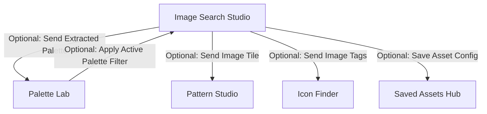

# Research & Architecture Report: Image Search Studio (DesignDeck)

> **DOCUMENT CONTROL**: 
> - **Category**: Research Report
> - **Location**: `docs/research/image_search_research_report.md`
> - **Status**: Immutable Baseline Specification
> - **Author**: Antigravity AI (Google DeepMind Team)

---

## 1. Executive Summary

This report defines the technical architecture, feature set, client-side algorithms, and optional cross-suite integrations for **Image Search Studio** — a new standalone mini-application suite designed for the **DesignDeck** multi-utility workspace.

Following DesignDeck's core philosophy, **Image Search Studio** operates as a self-contained, high-performance client-side suite. It empowers designers and developers to search, inspect, analyze, extract colors from, edit, and convert high-resolution royalty-free imagery without relying on costly server infrastructure.

---

## 2. Core Architecture & Design Philosophy

### 2.1 Mini-App Sub-Navigation Paradigm
Image Search Studio mirrors the layout and sub-navigation architecture established in **Palette Lab**, **Pattern Studio**, and **Icon Finder**:
- **Independent Parent Container**: `src/components/ImageSearch.jsx`
- **Sub-Component Directory**: `src/components/image/`
- **Collapsible Sub-Sidebar**: Seamlessly tab between specialized sub-tools:
  1. **Search & Discovery Hub** (`ImageSearchHub.jsx`)
  2. **Color Extractor Lab** (`ImageColorExtractor.jsx`)
  3. **Canvas Editor Studio** (`ImageEditorCanvas.jsx`)
  4. **Vector & Metadata Inspector** (`ImageVectorStudio.jsx`)
  5. **Export & Vault** (`ImageExport.jsx`)

### 2.2 Strict Separation of Concerns
Image Search Studio is **100% modular**. All search, canvas rendering, color sampling, and image manipulation logic are encapsulated inside `src/components/image/` and `src/utils/imageUtils.js`. It functions fully without requiring active states from other pages.

---

## 3. Detailed Subsystem Features & Sub-Tools

### 3.1 Search & Discovery Hub (`ImageSearchHub.jsx`)
- **Multi-Source Royalty-Free API Integration**:
  - **Openverse REST API** (`https://api.openverse.org/v1/images/`): 600M+ CC-licensed images across Wikimedia, NASA, Flickr, Met Museum.
  - **Wikimedia Commons API** (`https://commons.wikimedia.org/w/api.php`): Deep archive of public domain vector & media assets.
  - **Curated Fallback Dataset**: Built-in offline mock dataset for instant preview when offline or when API rate limits are reached.
  - **Optional User API Keys**: Settings field allowing users to input their own Unsplash / Pexels / Pixabay keys for enhanced search results.
- **Search & Filtering Controls**:
  - Keyword search with debouncing (450ms).
  - Orientation filter: All, Landscape, Portrait, Square.
  - License filter: All, Public Domain / CC0, Commercial Use Allowed, Attribution Required.
  - Primary Hue filter: Filter images matching specific color families (Red, Blue, Green, Dark, Bright).
  - Pagination & Infinite Scroll.

### 3.2 Color Extractor Lab (`ImageColorExtractor.jsx`)
- **Client-Side Canvas Pixel Sampler**:
  - Loads selected image onto an offscreen HTML5 `<canvas>`.
  - Samples pixel data using `getImageData()` and groups RGB values into HSL buckets.
  - Generates a 5-color dominant palette along with relative percentage breakdown.
- **Interactive Eyedropper Tool**:
  - Native EyeDropper API integration (`window.EyeDropper`) or canvas click sampler allowing users to pick exact pixel colors from any point on the image.

### 3.3 Canvas Editor Studio (`ImageEditorCanvas.jsx`)
- **Real-Time Client-Side Image Adjustments**:
  - **Sliders**: Brightness, Contrast, Saturation, Hue Rotation, Blur, Grayscale, Sepia, Invert.
  - **Transformations**: Flip Horizontal, Flip Vertical, 90° Step Rotations, Free Cropping (1:1, 16:9, 4:3, Custom).
  - **Watermark & Text Overlay**: Add text overlays with custom font size, color, and opacity.
- **Instant Canvas Rendering**: All filters render live at 60 FPS using HTML5 2D Canvas context filters.

### 3.4 Vector & Metadata Inspector (`ImageVectorStudio.jsx`)
- **Image Metadata Viewer**:
  - Displays original dimensions ($W \times H$), aspect ratio, file format, estimated file size, source attribution, and license details.
- **SVG Posterizer / Outline Trace Simulator**:
  - Converts high-res raster imagery into simplified vector SVG paths or thresholded outlines for design mockups.

### 3.5 Export & Vault (`ImageExport.jsx`)
- **Multi-Format Export**:
  - Download edited image in `.png`, `.jpg`, or `.webp` format with custom quality scaling.
  - Copy direct Image URL.
  - Copy HTML `` tag snippet with responsive `srcset`.
  - Copy Markdown `` snippet.
  - Save image configuration directly to DesignDeck's Local Storage Vault.

---

## 4. Optional Cross-Suite Connections (Non-Forced Integration)

To preserve module independence while providing power-user workflows, inter-tool connections are strictly **optional and user-triggered**:



1. **ImageSearch → Palette Lab**:
   - *Action*: Button "Send Palette to Palette Lab".
   - *Effect*: Replaces `activePalette` with the image's extracted 5-color dominant palette, allowing instant accessibility checking and UI visualizer previews.
2. **Palette Lab → ImageSearch**:
   - *Action*: Toggle "Filter Images by Active Palette".
   - *Effect*: Queries image search API using dominant hex/hue from Palette Lab to find visually harmonious background images.
3. **ImageSearch → Pattern Studio**:
   - *Action*: Button "Use as Pattern Background Tile".
   - *Effect*: Passes image URL to Pattern Studio for tile background overlay.
4. **ImageSearch → Icon Finder**:
   - *Action*: Button "Find Matching Icons".
   - *Effect*: Extracts image tags/keywords and opens Icon Finder search automatically.
5. **ImageSearch → Saved Assets**:
   - *Action*: Button "Save Image Asset".
   - *Effect*: Stores image metadata, filters, and extracted colors in `saved_images` inside local storage.

---

## 5. Algorithmic Logics & Math

### 5.1 Color Quantization Algorithm (Dominant Palette Extraction)
1. Draw image onto offscreen canvas scaled down to $150 \times 150$ pixels (improves performance while maintaining color distribution).
2. Extract RGBA pixel data: `const data = ctx.getImageData(0, 0, width, height).data`.
3. Filter out fully transparent pixels ($A < 128$) and extreme pure white/black values if desired.
4. Quantize pixels into HSL space ($H \in [0, 360), S \in [0, 100], L \in [0, 100]$).
5. Cluster pixels into 5 primary bins using K-Means or Octree color quantization.
6. Convert cluster centroids back to HEX format.

### 5.2 Canvas Filter Pipeline
$$\text{CSS Filter String} = \text{brightness}(b\%) \cdot \text{contrast}(c\%) \cdot \text{saturate}(s\%) \cdot \text{hue-rotate}(h\text{deg}) \cdot \text{blur}(p\text{px})$$
Rendered directly onto Canvas context:
```javascript
ctx.filter = `brightness(${brightness}%) contrast(${contrast}%) saturate(${saturation}%) hue-rotate(${hue}deg) blur(${blur}px)`;
ctx.drawImage(img, 0, 0, canvas.width, canvas.height);
```

---

## 6. Implementation Blueprint & File Manifest

| File Path | Description |
| :--- | :--- |
| `src/components/ImageSearch.jsx` | Parent suite container, layout, sub-sidebar navigation & tab controller |
| `src/components/image/ImageSearchHub.jsx` | API search bar, filter controls, gallery grid & preview modal |
| `src/components/image/ImageColorExtractor.jsx` | Canvas pixel sampler, dominant 5-color palette generator & eyedropper |
| `src/components/image/ImageEditorCanvas.jsx` | Live canvas photo editor (crop, rotate, filters, text overlay) |
| `src/components/image/ImageVectorStudio.jsx` | Image metadata viewer & SVG outline posterizer |
| `src/components/image/ImageExport.jsx` | Download manager (.webp, .jpg, .png), code snippet generator & local vault saver |
| `src/components/image/imageUtils.js` | Openverse API fetcher, Canvas quantization algorithm & filter string helper |

---

## 7. Conclusion & Next Steps

This research report provides a complete, self-contained, and scalable blueprint for adding **Image Search Studio** to DesignDeck.

Upon approval of the implementation plan, development can proceed systematically:
1. Create `imageUtils.js` helper methods.
2. Build sub-components (`ImageSearchHub`, `ImageColorExtractor`, `ImageEditorCanvas`, `ImageVectorStudio`, `ImageExport`).
3. Build parent `ImageSearch.jsx` suite.
4. Integrate `imagesearch` tab into main sidebar (`App.jsx`), landing grid (`Home.jsx`), and settings ([Settings.jsx](file:///a:/Multi%20Utility/src/components/Settings.jsx)).
