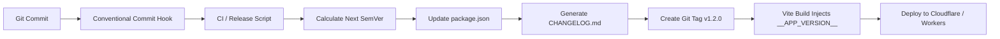

# Application Version Control, Release Strategies & Semantic Architecture Research Report

## 1. Executive Summary
Software versioning is the systematic discipline of assigning unique identifiers to states of software. In modern web and Progressive Web Applications (PWAs), version control is not just a label—it governs **database schema compatibility, API contracts, browser asset cache invalidation, Service Worker lifecycle synchronization, and automated CI/CD releases**.

This research report documents the industry-standard versioning frameworks used by technology leaders (e.g., Stripe, Linear, GitHub, Vercel, Figma), defines the exact meaning and rules of Semantic Versioning (SemVer 2.0), and outlines an enterprise-grade automated versioning implementation for **Krasola**.

---

## 2. Industry Versioning Frameworks & Comparative Analysis

```
                      ┌─────────────────────────────────┐
                      │    Semantic Version (SemVer)    │
                      │          MAJOR.MINOR.PATCH      │
                      │               1 . 2 . 0         │
                      └───────────────┬─────────────────┘
                                      │
        ┌─────────────────────────────┼─────────────────────────────┐
        ▼                             ▼                             ▼
  [ MAJOR (1.x.x) ]            [ MINOR (x.2.x) ]             [ PATCH (x.x.0) ]
• Breaking Changes           • New Features                • Bug Fixes
• Database Incompatibility   • Backward-Compatible         • Performance Tweaks
• Core Architecture Shifts   • New Tools / Studios         • Visual Fixes / Typo
```

### A. Semantic Versioning 2.0 (SemVer)
The global standard for software engineering ([semver.org](https://semver.org)):
* **Format:** `MAJOR.MINOR.PATCH[-PRERELEASE][+BUILDMETADATA]` (e.g., `v1.2.0-beta.1+20260818.8720cf2`)
* **When to Bump:**
  * **MAJOR (X.0.0):** Incompatible API changes, breaking database migrations, authentication protocol redesigns.
  * **MINOR (1.Y.0):** New features added in a backward-compatible manner (e.g., In-App Notification Center, new Pattern generator modes, SVG export).
  * **PATCH (1.2.Z):** Backward-compatible bug fixes, UI styling alignments, telemetry fallback fixes.

### B. Calendar Versioning (CalVer)
* **Format:** `YYYY.MM.MICRO` or `YY.MM` (Used by Ubuntu, JetBrains, Sentry, e.g., `2026.08.1`).
* **Best For:** Apps driven by regular scheduled calendar releases rather than feature-based milestones.

### C. Continuous Delivery (Git Hash / Build Metadata)
* **Format:** `v1.2.0-sha.8720cf2`
* **Best For:** Cloudflare Pages, Vercel, Netlify deployments where each git push generates an immutable preview build.

---

## 3. How Tech Leaders Manage Automated Versioning

Technology leaders remove manual human error through **Conventional Commits** paired with automated release workflows:

### A. Conventional Commits Standard
Every commit follows a standardized grammar:
* `feat(scope): ...` ➔ Automatically triggers a **MINOR** bump (`1.1.0 ➔ 1.2.0`).
* `fix(scope): ...` ➔ Automatically triggers a **PATCH** bump (`1.1.0 ➔ 1.1.1`).
* `perf(scope): ...` ➔ Automatically triggers a **PATCH** bump.
* `refactor(scope): ...` ➔ Automatically triggers a **PATCH** bump.
* `feat(scope)!: ...` or `BREAKING CHANGE:` ➔ Automatically triggers a **MAJOR** bump (`1.1.0 ➔ 2.0.0`).

### B. Automated Release Pipeline


---

## 4. Web & PWA Cache Invalidation Architecture

In web applications and PWAs, deploying a new version without proper cache invalidation causes users to remain stuck on stale JavaScript files.

### Critical Cache Invalidation Mechanisms:
1. **Vite Content Hashing:** Files are bundled as `assets/index-[hash].js`. When code changes, the hash changes, bypassing browser file caches.
2. **`version.json` Polling Strategy:** Build generates a static `/version.json` file served with `Cache-Control: no-cache, no-store`. The app periodically checks this file:
   $$\Delta(\text{Local Version}, \text{Remote Version}) > 0 \implies \text{Show "Update Available" Toast}$$
3. **Service Worker Cache Rotation:** The Service Worker (`sw.js`) contains `const CACHE_NAME = 'krasola-v' + APP_VERSION;`. When the version increments, the Service Worker automatically deletes all outdated caches during its `activate` lifecycle event.

---

## 5. Implementation Strategy for Krasola

### Phase 1: Build-Time Version & Git Hash Injection (`vite.config.js`)
Expose compile-time constants:
```javascript
// vite.config.js
import { execSync } from 'child_process';
import pkg from './package.json';

const commitHash = execSync('git rev-parse --short HEAD').toString().trim();
const buildTime = new Date().toISOString();

export default defineConfig({
  define: {
    __APP_VERSION__: JSON.stringify(pkg.version),
    __BUILD_TIMESTAMP__: JSON.stringify(buildTime),
    __COMMIT_HASH__: JSON.stringify(commitHash)
  }
});
```

### Phase 2: Centralized Version Manager (`src/utils/versionManager.js`)
Provides:
* `APP_VERSION` (e.g., `1.2.0`)
* `COMMIT_HASH` (e.g., `8720cf2`)
* `BUILD_DATE` (e.g., `Aug 18, 2026`)
* `CHECK_FOR_UPDATES()` function for PWA update prompts.

### Phase 3: UI Surfaces for Version Transparency
1. **Sidebar Footer:** Displays clickable version badge (`v1.2.0 · 8720cf2`).
2. **Settings Studio:** Displays full system diagnostics, environment status (`Production`), build timestamp, and an "Check for Updates" button.
3. **PWA Service Worker:** Synced cache versioning to guarantee clean updates.

### Phase 4: Developer Release CLI Commands (`package.json`)
```json
"scripts": {
  "release:patch": "npm version patch && git push origin main --tags",
  "release:minor": "npm version minor && git push origin main --tags",
  "release:major": "npm version major && git push origin main --tags"
}
```
